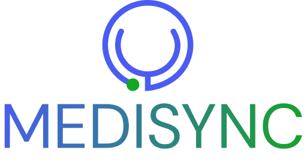

<!-- Improved compatibility of back to top link: See: https://github.com/othneildrew/Best-README-Template/pull/73 -->

<!-- PROJECT LOGO -->
 

  

  <h3 align="center">Website Medisync</h3>

  

    ·
    <a href="https://medisync.rf.gd/">View Demo</a>
    ·
    <a href="https://github.com/dpbayu">Report Bug</a>
    ·
    <a href="https://github.com/dpbayu">Request Feature</a>
  

<!-- TABLE OF CONTENTS -->

  
Table of Contents

  <ol>
    <li>
      <a href="#about-the-project">About The Project</a>
      <ul>
        <li><a href="#built-with">Built With</a></li>
      </ul>
    </li>
    <li><a href="#contact">Contact</a></li>
  </ol>

<!-- ABOUT THE PROJECT -->
## About The Project

Medisync is an innovative web application specifically designed to assist medical clinics in managing and aligning various aspects of their operations. Medisync aims to optimize efficiency, improve service quality, and provide comprehensive solutions for medical clinics and patients.

(<a href="#readme-top">back to top</a>)

### Built With

- [PHP](http://php.net)
- [Bootstrap](http://getbootstrap.com/)
- [jQuery](https://jquery.com/)

(<a href="#readme-top">back to top</a>)

<!-- CONTACT -->
## Contact

Dwi Putra Bayu Oktantyo - [Instagram](https://instagram.com/dwptrbayu) - dwiputrabayu19@gmail.com
 
Project Link: [Portfolio](https://dwiputrabayu.vercel.app/#portfolio)

(<a href="#readme-top">back to top</a>)

